# The website is at: [S3 AWS](http://elasticbeanstalk-eu-west-3-898320771394.s3-website.eu-west-3.amazonaws.com/)


# AWS account

## Create account
https://aws.amazon.com/resources/create-account/  
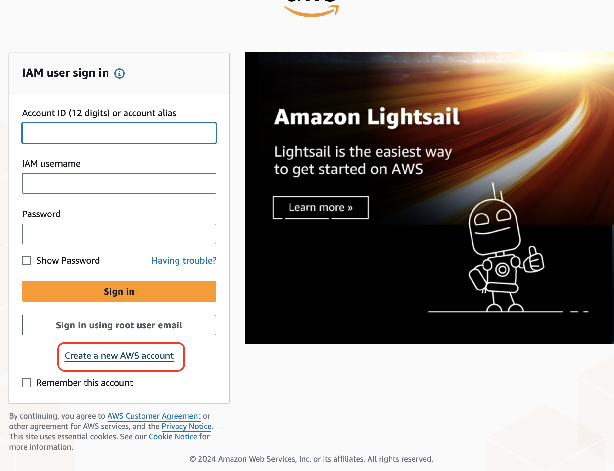
## Create S3 bucket
From the console, navigate to Amazon S3 and click on create bucket:  
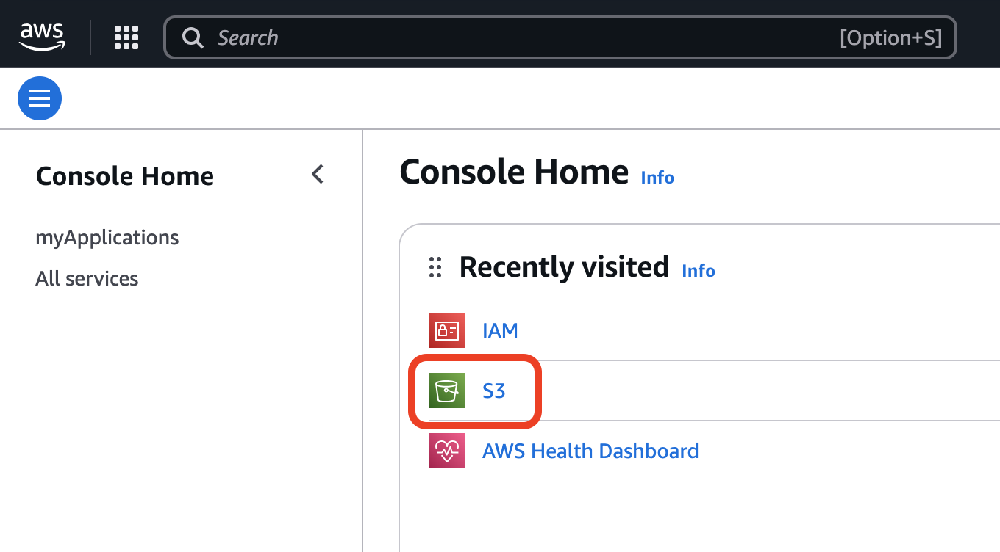
- Enter a bucket name: choose a unique name that mimics a website (e.g. mysite.com) Select an AWS region: Choose a region close to you (e.g. London region — eu.west.2) Deselect Block all public access and acknowledge the warning.
- Click on create bucket  
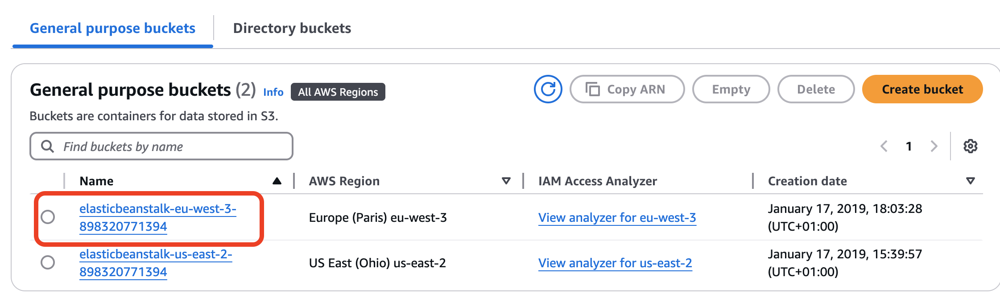
- Click on your brand new bucket and choose the properties tab. Scroll all the way down to Static Website Hosting, click on edit, and perform the following actions:  
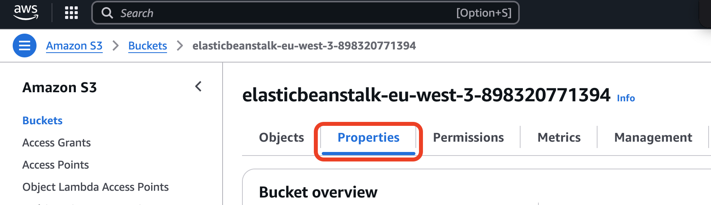
- Enable website hosting
- Under hosting type, choose Host a static website
- Under the index document enter ‘index.html’. The error document is optional, you do not have to fill it in.  
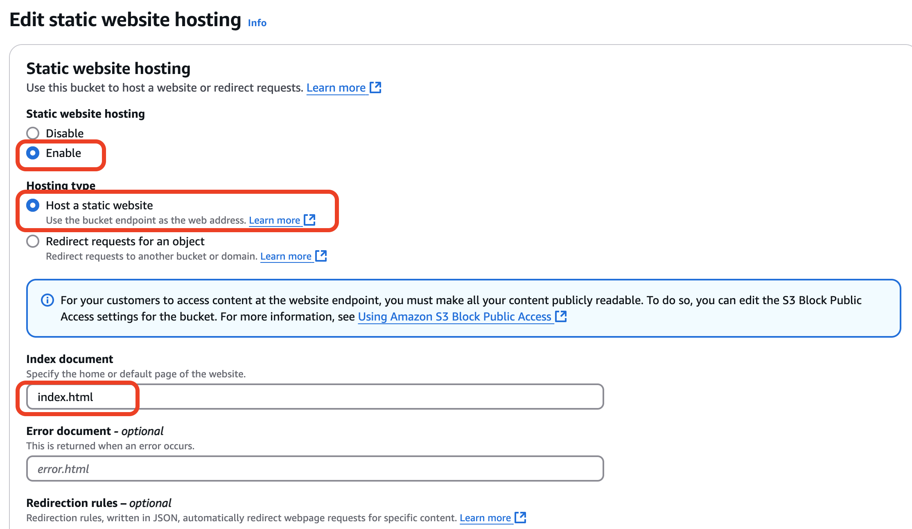
- Save changes  
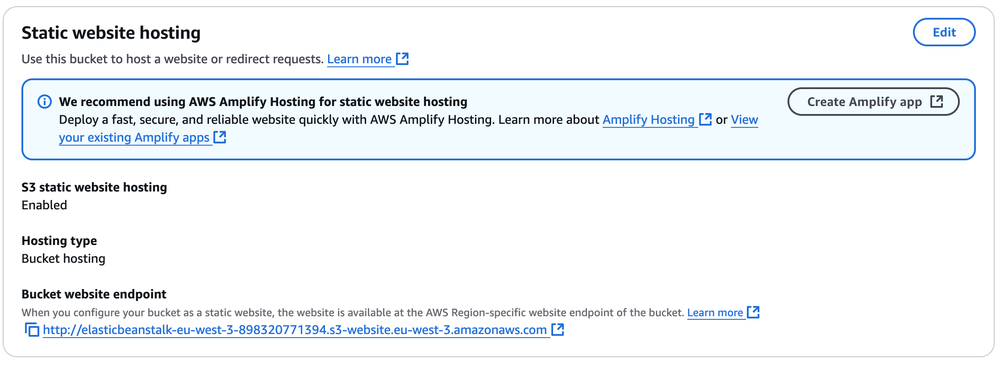
## Set up bucket policy
Navigate to the Permissions tab of your S3 bucket. Under Bucket Policy, click on edit.  
Paste next content  
(change <span style="color:brown">YOUR_BUCKET_NAME</span> accordingly):
```JSON
{
  "Version": "2012-10-17", 
  "Statement": [
    {
      "Sid": "awsStaticWebSite",
      "Effect": "Allow",
      "Principal": "*",
      "Action": "s3:GetObject",
      "Resource": "arn:aws:s3:::YOUR_BUCKET_NAME/*"
    }
  ]
}
```
## Upload index.html
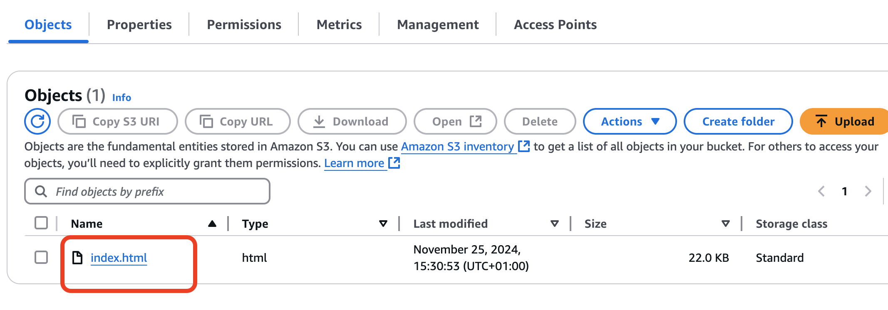  

Navigate to the Properties tab, Static website hosting block. Open Bucket website endpoint: http://elasticbeanstalk-eu-west-3-898320771394.s3-website.eu-west-3.amazonaws.com/

## Create IAM user
Create an IAM user, add AmazonS3FullAccess permission under the Permission Policies, skip tagging. Create __Access Key__. Github will use it to upload index.html.  
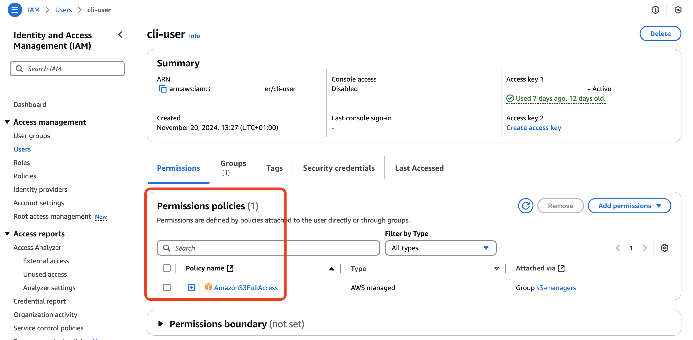  


# GITHUB
- Create github repo
- Add directory with ‘web’ name, insert index.html
Web directory will be synced with the content of your S3 bucket  
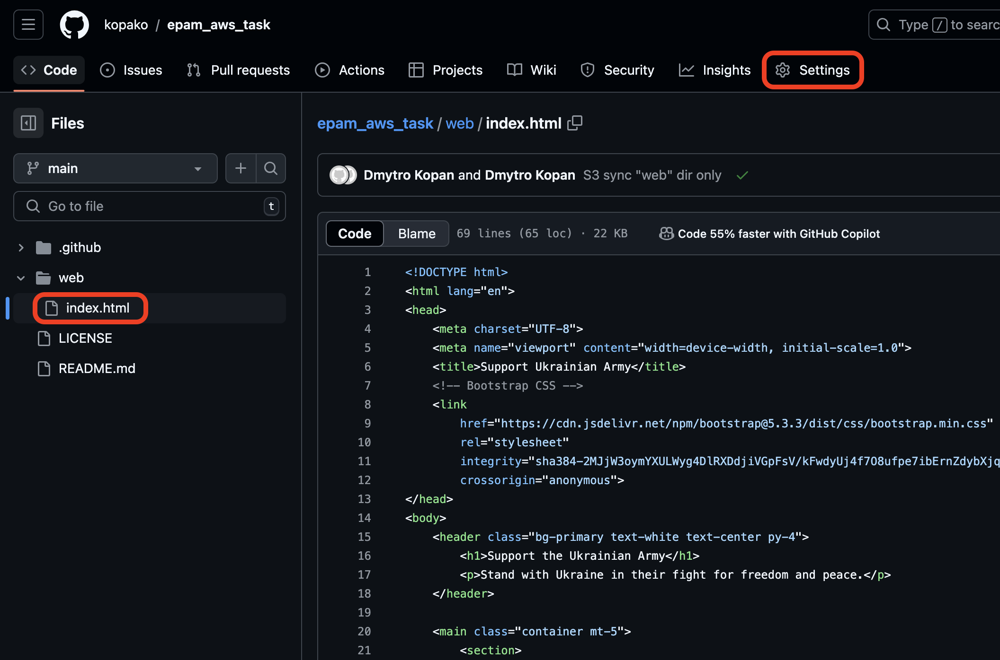  
- Go to the “Actions” tab of the repository, click on <u>set up a workflow yourself</u>  
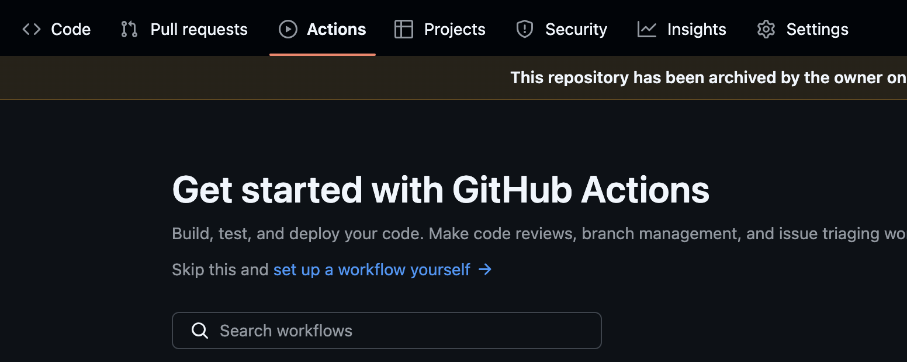  
Insert next content:
```YAML
name: Upload Website

on:
  push:
    branches:
      - main

jobs:
  deploy-site:
    runs-on: ubuntu-latest
    steps:
    - uses: actions/checkout@v2
    - uses: jakejarvis/s3-sync-action@master
      with:
        args: --delete
      env:
        AWS_S3_BUCKET: YOUR_BUCKET_NAME
        AWS_ACCESS_KEY_ID: ${{ secrets.AWS_ACCESS_KEY_ID }}
        AWS_SECRET_ACCESS_KEY: ${{ secrets.AWS_SECRET_ACCESS_KEY }}
        SOURCE_DIR: ./web
```

- Go to the “Settings” tab of the repository → Secrets and variables → Actions → Repository secrets → New repository secret  
Create “AWS_ACCESS_KEY_ID” and “AWS_SECRET_ACCESS_KEY” with the content of AWS IAM user’s Access Key that we created before (these are hardcoded names from jakejarvis/s3-sync-action)  
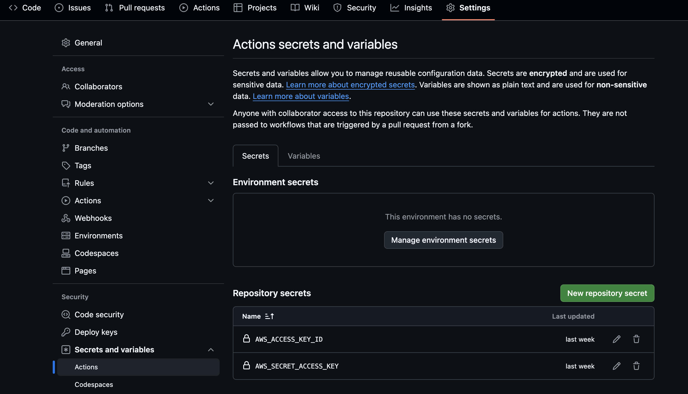  
- Push the commit to the repository to execute the action, check if action finished successfully  
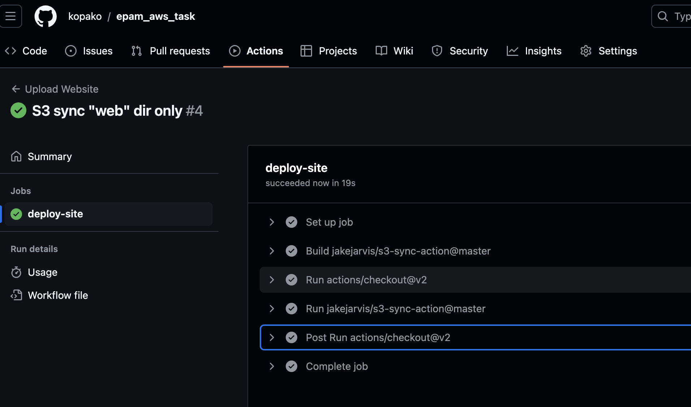  